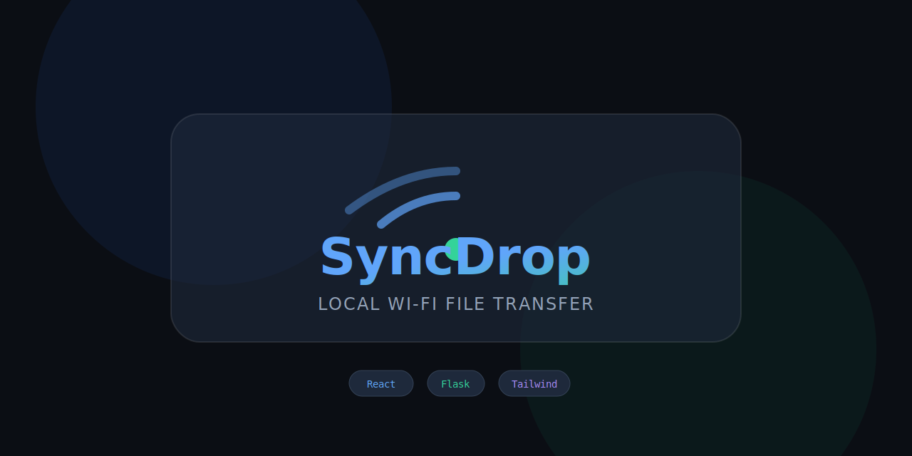

<div align="center">
  
  <br/>
  <h1>🚀 SyncDrop</h1>
  <p><b>Lightning-fast, premium local network file transfer from Mobile to PC.</b></p>
</div>

---

## 🌟 About SyncDrop

SyncDrop is a modern web application designed to bridge the gap between your mobile device and your computer. By leveraging your local Wi-Fi network, SyncDrop allows you to seamlessly beam photos, videos, and documents directly to your PC's downloads folder without cables, cloud storage limits, or third-party apps.

## ✨ Features

- **📱 QR Code Discovery:** No IP addresses to type. Just scan the dynamic QR code on your PC screen with your phone's camera.
- **⚡ Real-Time Streaming:** Instant, byte-accurate progress bars and success states using pure `XMLHttpRequest` and Server-Sent Events (SSE).
- **📥 Auto-Queue Native Downloads:** Files uploaded to the server are instantly pushed to your desktop browser and downloaded automatically via a smart queuing system.
- **🎨 Premium UI/UX:** Built with TailwindCSS and Motion, featuring dynamic glassmorphism, background blurs, and satisfying micro-animations.
- **🛡️ Duplicate Prevention:** Multi-tab deduplication locks prevent the same file from being downloaded twice if you have multiple tabs open.
- **📶 Network Awareness:** Built-in offline detection to warn you if your device loses its connection.

---

## 📋 Requirements

Before running the application, ensure you have the following installed on your host machine (PC):

- **Python 3.8+** (for the Flask backend)
- **Node.js 16+ & npm** (for the React frontend)
- **A shared Wi-Fi network** (Both your PC and Mobile device **MUST** be connected to the exact same Wi-Fi router for the discovery to work).

---

## 🚀 How to Run Locally

Because SyncDrop utilizes a decoupled architecture, you need to start both the Python backend and the React frontend.

### 1. Start the Backend Server (Terminal 1)
The backend handles the actual file storage and real-time SSE networking.

```bash
# Install the required Python dependencies
pip install -r requirements.txt

# Start the server
python app.py
```
*The server will start on port 5000 and print out the IP address you need to visit.*

### 2. Start the Frontend Application (Terminal 2)
The frontend serves the desktop dashboard and the dynamic QR code.

```bash
# Install the Node dependencies
npm install

# Start the Vite development server and expose it to the network
npm run dev -- --host
```
*(⚠️ **CRITICAL:** The `--host` flag is required. Without it, your phone will not be able to connect to the React application over your Wi-Fi).*

### 3. Start Transferring!
1. Open your PC browser and navigate to the `Network` URL provided by Vite (e.g., `http://192.168.x.x:3000`).
2. Point your phone's camera at the giant QR code on your monitor.
3. Select files on your phone and watch them automatically arrive in your PC's "Downloads" folder!

---

## ⚠️ Important Conditions & Limitations

- **Cloud Deployment (Vercel/Heroku):** SyncDrop is fundamentally engineered as a **Local Network Tool**. It utilizes your PC's local `temp` directory for storage and in-memory variables for streaming state. **Deploying this backend to a serverless platform like Vercel will fail**, as serverless functions spin down and destroy local file storage instantly.
- **File Size Limits:** The backend is currently optimized for rapid file transfers. While there are no hard limits built into the backend, extremely large video files (4GB+) may take a while depending on your router bandwidth.
- **Browser Security (HTTPS):** Because the app runs on a local IP address (`192.168...`), some modern mobile browsers (like Safari) might temporarily block native camera access. However, selecting files from the gallery works perfectly.
